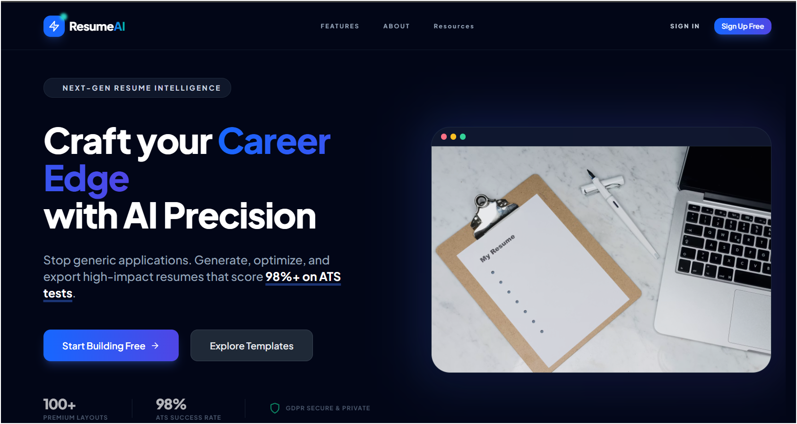
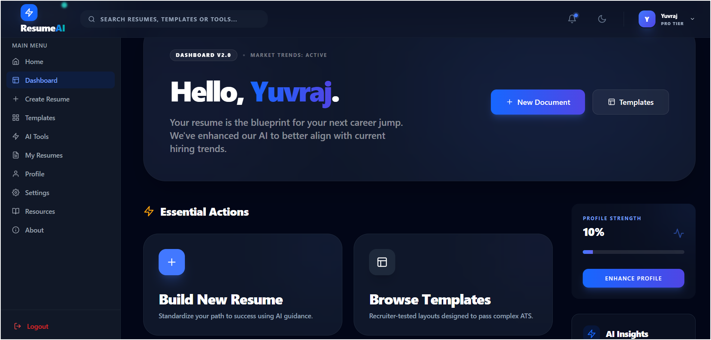
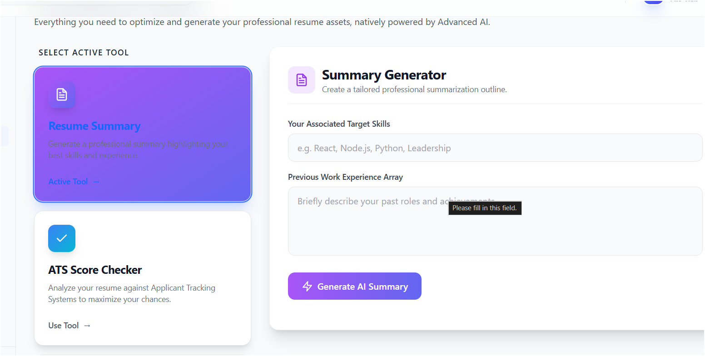
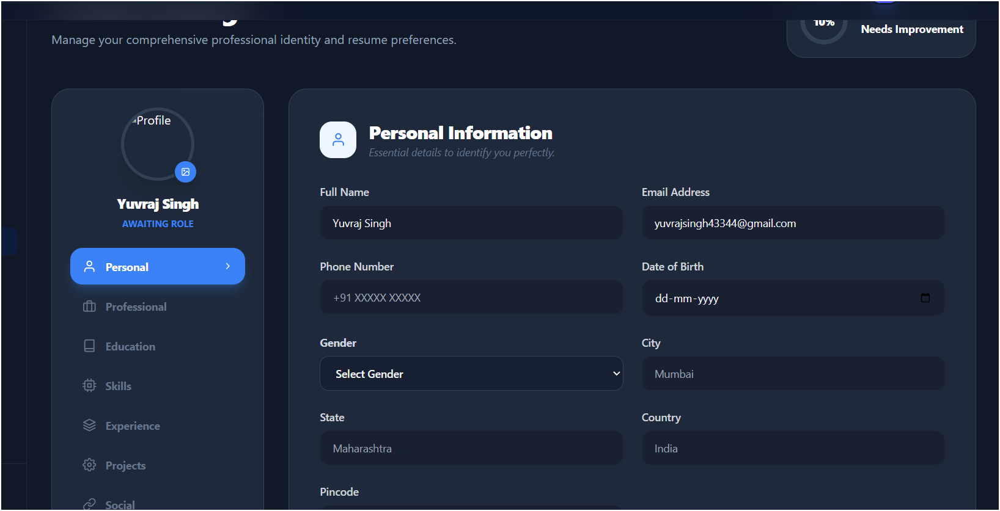

# AI-Powered Resume Builder 🚀

A high-performance, full-stack web application designed to help professionals craft high-impact, ATS-optimized resumes using advanced AI intelligence. This platform combines a secure authentication system with intuitive tools for building, managing, and enhancing resume content.

## 🚀 Live Demo

- **Frontend**: [https://ai-powered-resume-builder-theta.vercel.app](https://ai-powered-resume-builder-theta.vercel.app)
- **Backend API**: [https://ai-resume-backend-pg2k.onrender.com](https://ai-resume-backend-pg2k.onrender.com)
- **GitHub Repo**: [https://github.com/Yuvi4242/AI-Powered_Resume-Builder](https://github.com/Yuvi4242/AI-Powered_Resume-Builder)

---

## ✨ Features

### Authentication & Security
- **OTP-Based Verification**: Secure user signup with 6-digit email verification.
- **Robust Authorization**: JWT-based session management with protected routes.
- **Account Recovery**: Comprehensive Forgot Password / Reset Password flow.
- **Security Headers**: Implementation of Helmet.js for enhanced production security.

### User Profile Management
- **Centralized Data**: Create and update professional profile details stored in MongoDB.
- **Persistent Sessions**: Seamless user experience with state-aware navigation.

### AI-Powered Resume Builder
- **AI-Assisted Content**: Intelligent generation and optimization of resume sections.
- **Smart Suggestions**: Context-aware writing tips for better resume quality.
- **Structured Workflow**: Intuitive interface for managing complex resume data.

### Production-Ready Infrastructure
- **Cross-Origin Security**: Configured CORS for secure Vercel-to-Render communication.
- **Reliable Dispatch**: Migrated to Resend HTTP API for high-deliverability OTP emails.
- **Production Monitoring**: Sanitized logging and environment-based configurations.

---

## 📸 Screenshots
A quick visual overview of the application interface and key user flows.

### Home / Landing Page


### Login Page


### Signup / OTP Page


### Resume Builder Dashboard


### AI Resume Assistant / Tool


### Profile / User Section


---

## 🛠️ Tech Stack

### Frontend
- **React.js**: Modern component-based architecture.
- **Tailwind CSS**: Professional, glassmorphic styling system.
- **Framer Motion**: Smooth, high-end UI animations.

### Backend
- **Node.js & Express.js**: High-performance RESTful API.
- **MongoDB (Atlas)**: Scalable NoSQL database layer.
- **Resend API**: Professional email infrastructure for OTP delivery.
- **JWT**: Secure token-based authentication.

### DevOps
- **Vercel**: Optimized frontend hosting.
- **Render**: Reliable backend service deployment.
- **MongoDB Atlas**: Cloud-hosted database synchronization.

---

## 📂 Project Structure

```bash
AI_Resume/
│
├── frontend/        # React.js application
├── backend/         # Node.js + Express.js API
├── README.md        # Comprehensive project documentation
└── ...
```

---

## ⚙️ Environment Variables

### Backend `.env`
```env
PORT=5000
MONGO_URI=your_mongodb_connection_string
JWT_SECRET=your_jwt_secret
RESEND_API_KEY=your_resend_api_key
EMAIL_FROM=onboarding@resend.dev
FRONTEND_URL=https://ai-powered-resume-builder-theta.vercel.app
NODE_ENV=production
```

### Frontend `.env`
```env
REACT_APP_API_URL=https://ai-resume-backend-pg2k.onrender.com
```

---

## ▶️ Local Setup

### 1. Clone the repository
```bash
git clone https://github.com/Yuvi4242/AI-Powered_Resume-Builder.git
cd AI-Powered_Resume-Builder
```

### 2. Install dependencies
**Backend:**
```bash
cd backend
npm install
```

**Frontend:**
```bash
cd ../frontend
npm install
```

### 3. Run Locally
**Start Backend (Dev Mode):**
```bash
cd backend
npm run dev
```

**Start Frontend:**
```bash
cd frontend
npm start
```

---

## 🔄 Authentication Flow

1. **User Signup**: User submits details; a 6-digit OTP is generated.
2. **Email Delivery**: OTP is delivered via Resend API to the registered email.
3. **Verification**: OTP is verified against the database before account activation.
4. **Secure Login**: User receives a JWT for subsequent authorized requests.
5. **Session Management**: JWT is used to access protected Resume and Profile routes.

---

## 🧪 Demo Note
> [!IMPORTANT]
> **Sandbox Mode**: Email OTP is currently running in testing mode. For demonstration purposes, OTP email delivery is enabled only for the configured test email address. The core authentication and OTP flow are otherwise fully implemented and production-ready.

---

## 📌 Challenges Solved
- **Deployment Stabilization**: Resolved critical `ENETUNREACH` issues on Render by migrating from SMTP/Nodemailer to the Resend HTTP API.
- **CORS Optimization**: Configured dynamic origin whitelisting to enable secure communication between Vercel and Render.
- **Auth Robustness**: Built a database-backed OTP verification system with expiration logic and secure password hashing.
- **Full-Stack Sync**: Unified environment variable management to ensure seamless local-to-production transitions.

---

## 🔮 Future Improvements
- [ ] **Resume PDF Export**: High-fidelity A4 PDF generation.
- [ ] **Templates Library**: Multiple professional resume design options.
- [ ] **AI-Generated Cover Letters**: Expand AI capabilities to cover letter drafting.
- [ ] **Public Portfolio Sharing**: Generate shareable links for hosted resumes.
- [ ] **OAuth Integration**: Social login support (Google/GitHub).

---

## 👨‍💻 Author

**Yuvraj Singh**
- **LinkedIn**: [LinkedIn Profile](https://www.linkedin.com/in/yuvi4242)
- **GitHub**: [@Yuvi4242](https://github.com/Yuvi4242)

---
**Tech Stack**: React.js, Node.js, Express.js, MongoDB, JWT, Resend API, Vercel, Render
